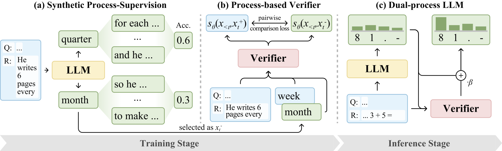

<h2 align="center">LLM2: Let Large Language Models Harness System 2 Reasoning</h2>

<!-- <h5 align="center">
[]()
[](https://opensource.org/licenses/MIT)
</h5> -->

## 🎉 What's New

[2024.12.31] Repository of LLM2 is released. The repository is still under active refinement and improvement.

## 🎈 Introduction

We introduce LLM2, a novel framework that combines an LLM (System 1) with a process-based verifier (System 2).
Within LLM2, the LLM is responsible for generating plausible candidates, while the verifier provides timely process-based feedback to distinguish desirable and undesirable outputs. The verifier is trained with a pairwise comparison loss on synthetic process-supervision data generated through our token quality exploration strategy.

<div align="center">

</div>

## 🚀 Quick Start

This section provides a quick guide to using the **LLM2** framework with `Llama-3.2-1B-Instruct` on the `GSM8k` dataset.

### Step 1: Install Environment

```bash
pip install -r requirements.txt
```

### Step 2: Training

```bash
bash scripts/train_verifier.sh
```

### Step 3: Inference

```bash
bash scripts/evaluate_gsm8k.sh
```

## 📚 Dataset

Datasets for models `Llama-3.2-1B-Instruct`, `Llama-3.2-3B-Instruct`, and `Meta-Llama-3.1-8B-Instruct` are located in the `./dataset` directory. Each dataset file, such as `Llama-3.2-1B-Instruct.jsonl`, follows this structure:

```json
{
  "messages": [
    {"content": "Natalia sold clips to 48 of her friends in April, and then she sold half as many clips in May. How many clips did Natalia sell altogether in April and May?", "role": "user"},
    {"content": "Natalia sold 48 / 2 = 24 clips in May. Natalia sold 48 + 24 = 72 clips altogether in April and May. So the answer is 72.", "role": "assistant"}
  ],
  "samples": [
    [52,220,264],[52,220,264],[53,2166,17],[53,2166,1187],[54,611,489],[54,611,353],[55,220,19],[55,220,662],[56,17,18],[56,17,19],[57,284,353],[57,284,353],[58,220,27203],[58,220,27203],[59,1187,1419],
    [59,1187,17],[68,2166,17],[68,2166,19],[69,489,865],[69,489,353],[70,220,508],[70,220,914],[71,1187,2166],[71,1187,914],[74,5332,717],[74,5332,1187],[87,5332,8929],[87,5332,8929]
  ]
}
```

- **`messages`**: OpenAI-style chat messages.  
- **`samples`**: List of sampled negative tokens. Each triplet contains:
  - **Token position** (after applying the chat template and tokenizing `messages`).
  - **Ground truth token ID**.
  - **Negative token ID**.

## 📑 Citation

If you find this repository useful, please consider giving star and citing our paper:

```
@article{yang2024llm,
  title = {LLM2: Let Large Language Models Harness System 2 Reasoning},
  author = {Yang, Cheng and Shi, Chufan and Li, Siheng and Shui, Bo and Yang, Yujiu and Lam, Wai},
  year={2024},
  journal={arXiv preprint arXiv:2412.20372},
}
```
